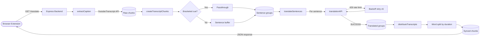
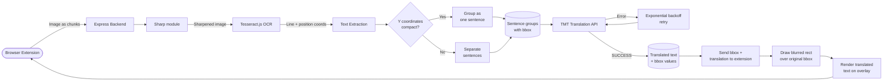

# TMT Trilingual Translator — Firefox Extension

A Firefox browser extension built for the **Google TMT Hackathon 2026**, organized by the Information and Language Processing Research Lab at Kathmandu University, aimed to promote social media literacy. The extension bridges the language gap between **English, Nepali, and Tamang** by bringing real-time translation directly into the browser — no copy-pasting, no switching tabs.

Built by team **Rendezvous**.

---

## Supported Language Directions

English ↔ Nepali · English ↔ Tamang · Nepali ↔ Tamang

---

## Architecture Overview

Firefox Extension  
↓  
Express Proxy Server (localhost:3000)  
↓  
TMT Translation API (tmt.ilprl.ku.edu.np)

The extension never talks to the TMT API directly. All requests go through a local Express proxy server which keeps the API token secure and handles retries and error management.

---

## Feature 1 — Highlight & Translate

Translate any text on any webpage instantly by simply selecting it.

- User highlights any text on any webpage
- A tooltip appears near the cursor showing the translation
- No clicking, no menus — just highlight and read
- Supports paragraph-level translation — selected text is split into sentences and translated individually
- Progress indicator shows "Translating sentence 1/10..." as each sentence is processed
- Selections exceeding 10 sentences are rejected with a warning in the tooltip
- Automatically retries up to 5 times per sentence if the API is slow or temporarily unavailable
- Tooltip dismisses when user clicks anywhere on the page

---

## Feature 2 — Text Box Translation

Translate text directly inside any input field on any website — comment boxes, search bars, forms, chat inputs, and more.

- User clicks into any text box on any website
- A small **TMT** button appears in the bottom right corner of the input
- User types their text, clicks **TMT** — text is instantly replaced with the translation
- Supports paragraph-level translation — text is split into sentences, each translated individually and reassembled
- Button shows live progress (1/10, 2/10...) as each sentence is translated
- Selections exceeding 10 sentences are rejected — button flashes red with "Too long"
- Button changes to **↩** after translation — clicking it restores the original text
- If the user edits the translated text, button automatically resets back to **TMT**
- Automatically retries up to 5 times per sentence if the API is slow or temporarily unavailable
- Supports standard textareas, input fields, and contenteditable divs (Gemini, ChatGPT, Gmail, etc.)

---

## Feature 3 — YouTube Transcript Translation

Translate the full transcript of any YouTube video into your language, synced to the video timeline.

- User opens any YouTube video with English captions
- A translate button appears in the extension — user selects their target language and clicks Translate
- The entire transcript is fetched, broken into natural sentences, and translated
- Translated subtitles appear as an overlay on the video, time-synced with the original audio
- Words are distributed proportionally across subtitle chunks based on duration — so captions stay in sync even when translated text is longer or shorter than the original

## Architectural Design 

## Feature 4 — Image Translator

Extract, translate, and overlay text from images across the web.

- User right clicks on an image
- Chooses translate image text
- Chooses source and target language
- Backend uses OCR (Tesseract) to detect and extract text from the image
- Extracted text is translated between English, Nepali, and Tamang
- Translated text is overlaid back onto the original image
- Maintains approximate positioning for readability
- Works on memes, screenshots, posters, and social media images

##Architectural Design 

---

## Project Structure

tmt-extension/  
├── manifest.json # Extension config (Firefox MV2)  
├── background.js # Handles API calls and retries  
├── content.js # Injected into webpages — all UI logic  
├── popup/  
├── icons/  
└── backend/ # Express proxy server  
└── package.json

---

## Environment File

- Is stored inside of tmt-extension/backend
- TMT_API_URL=https://tmt.ilprl.ku.edu.np/lang-translate
- TMT_API_TOKEN

## Build Project

The project's backend is deployed on cloud and also contains it's local implementation.

- Cloud deployment

To run unzip from the release and open the manifest.json from mozilla firefox

- Local deployment

- Unzip the release folder
- Run the following command:
- cd backend
- npm install
- node server.js

#Test
- Follow the instructions : 
- cd backend
- npm install
- node server.js
- open manifest.json from firefox

## Built With

- Firefox WebExtensions API (Manifest V2)
- Node.js + Express
- Tesseract OCR
- TMT Translation API — Google TMT, KU ILPRL
- Firefox WebExtensions API (Manifest V2)
- Node.js + Express
- TMT Translation API — Google TMT, KU ILPRL

---

## Demo Link

https://drive.google.com/file/d/1FMc7mqHBL4PV4y9OSUQI-aC8rceVHwMR/view?usp=drive_web

---

## Hackathon

**Google TMT Hackathon 2026**  
Information and Language Processing Research Lab  
Department of Computer Science and Engineering  
Kathmandu University, Dhulikhel, Nepal

Track: Browser Plugin / Extension  
Team: Rendezvous

